# 物理マシンへのインストール

## インストールメディアの取得と準備

[IncusOSイメージの取得](../download.md)の手順に従ってください。

仮想CD-ROMドライブを使うマシンにインストールする場合はISO形式を使ってください。
USBメモリーか仮想USBドライブを使ってインストールする場合はUSB形式を使ってください。

USBイメージを使う場合、デバイスに直接書き込むようにしてください。組み込みのパーティションやデータを一切変更しないようにしてください。

準備できたら、USBメモリーを挿すか仮想メディアを取り付けてサーバーを再起動しファームウェアメニュー（BIOS）を開いてください。

## BIOSを設定

ベンダーごとにファームウェアー設定のレイアウトは異なりますが、一般に主に設定する項目は以下のとおりです：

- RAIDモード設定オプションを無効にする（プラットフォームによってはIncusOSのブートが失敗します）
- TPM 2.0デバイスを有効にする（まだ有効でない場合）
- セキュアブートを有効にして設定する
   - "custom"セキュリティーポリシーを使う
   - 利用可能なら、システムが"user"モードになっていることを確認する
   - IncusOSのキーをロード：
      - KEKからすべてを削除し、IncusOS KEKのキーをロードする
      - DBからできるだけ多くのキーを削除し、IncusOS DBのキーをロードする
- インストールメディアから起動するようにブートオーダーを変更する

```{note}
サーバーによってはNVMEやストレージコントローラーから起動するためには特定のセキュアブートキーがロードされている必要があります。
たいていはMicrosoft UEFI CA キーに依存しており、そのためこれらのキーをDB内に残しておく必要があります。
```

別の方法として"setup"モードを使ってIncusOSのセキュアブートキーを手動でロードすることもできます。
これは事実上すべてのキーをクリアーし、IncusOSが初回のブート時にプロビジョンを行うことになります。
便利な半面、どのキーをロードするかの制御はしにくくなりアドインカードと干渉する可能性があります。

````{tabs}
```{group-tab} Generic

セキュアブートが一番厄介で設定方法はベンダーごとに異なります。

セキュアブートに関しては2つの主なオプションがあります：

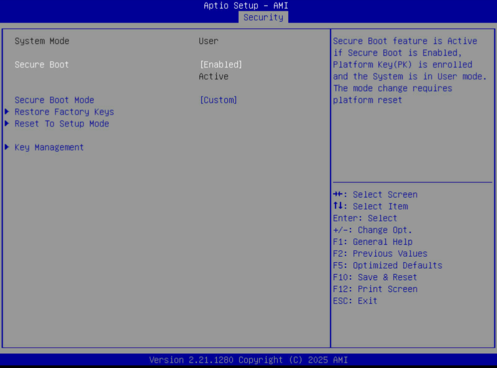

- いくつかの既存のキーを手動でクリアーしてIncusOSのキーを登録する
- すべてをクリアーしてシステムをセットアップモードにする

セキュアブートのセットアップモードが一番簡単です。というのはたいてい1つのオプションを選ぶだけでシステムはセキュアブートの鍵が空の状態でブートしIncusOSが鍵をメディアからインストールできるからです。

このアプローチの欠点は既存のすべての鍵が削除されることです。たいていの場合はこれは問題ないですが、起動時にファームウェアーコンポーネントが必要なハードウェアーをお持ちかもしれません。ネットワークカードやストレージコントローラーにもこのようなハードウェアーが存在します。

これらのシナリオでは、代わりにIncuSOSのKEKとDBの鍵を手動でインストールが必要です。ただし、ファームウェアーがこのためのオプションを提供していることが前提となります。

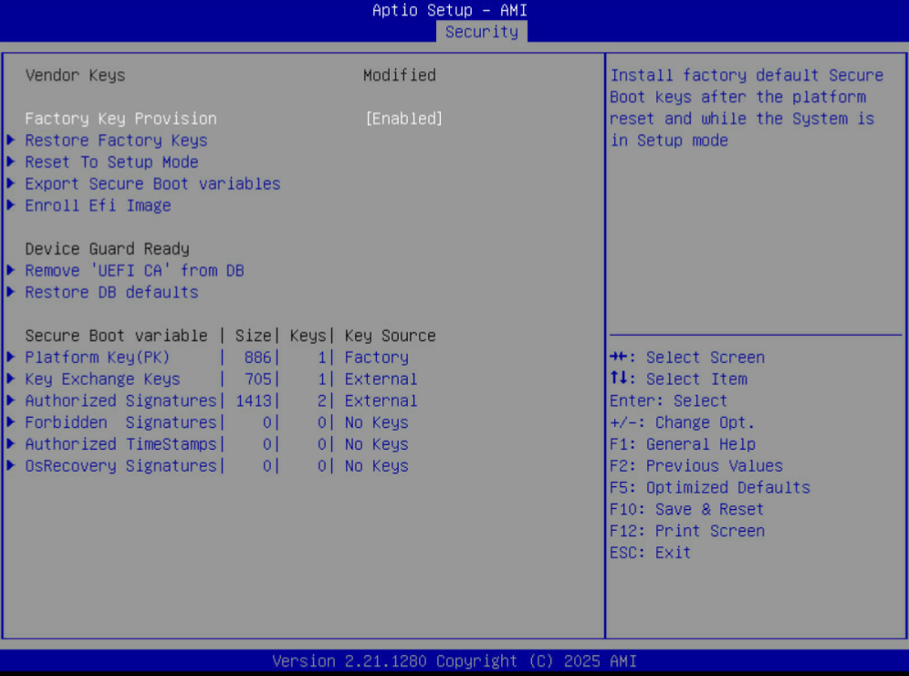
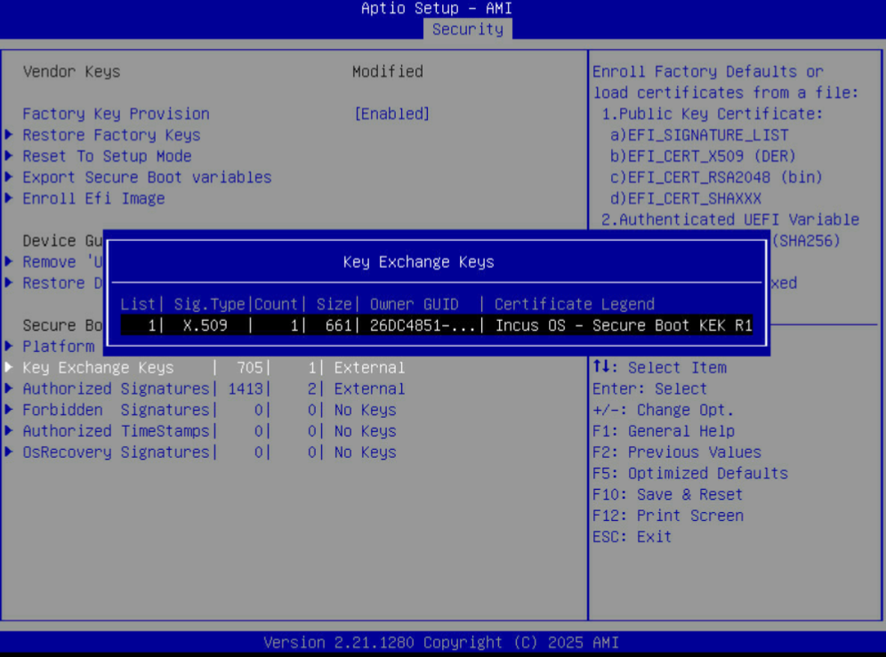
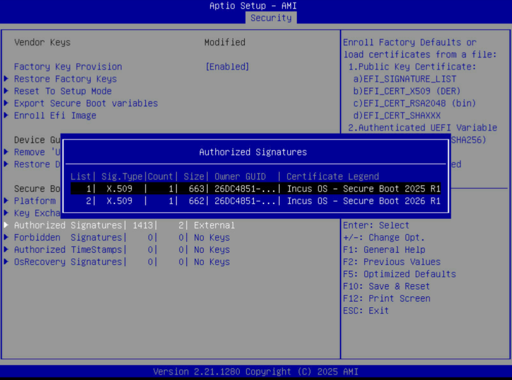

インストールメディアに`keys`フォルダーがあり、そこに`.der`形式の登録が必要な3つの鍵が含まれています。手動での登録方法はベンダーによってかなり異なります。

セキュアブートの設定が完了したら、ブートオーダーのページでシステムがインストールメディアから起動するように変更し、最後に設定を保存してシステムを再起動します。
```

```{group-tab} Asus
AsusのサーバーはAMI Aptioベースのファームウェアーを標準的なレイアウトで使用しています。

これらのサーバーは通常のブート操作を処理するのに追加のセキュアブートキーをロードする必要はなく、結果として、すべてのDBキーを削除しても安全です。


```

```{group-tab} Cisco
Cisco UCSサーバーはセキュアブートの完全な設定は提供していません。
代わりに限られた数の出来合いのセキュアブート設定があるだけであり、そのためIncusOSとは互換性がありません。

これらのサーバーにIncusOSをインストールするには、セキュアブートを無効にし、代わりにTPMのみのブートセキュリティーを使うように設定したIncusOSイメージを使う必要があります。
```

```{group-tab} DELL
DELLのサーバーはセキュアブートの完全な設定を提供します。

これらのサーバーのNVMEとストレージコントローラーはブートするためにMicrosoft UEFI CAに依存していることが多く、結果としてこれらのキーはDBに残しておくのが良いです。

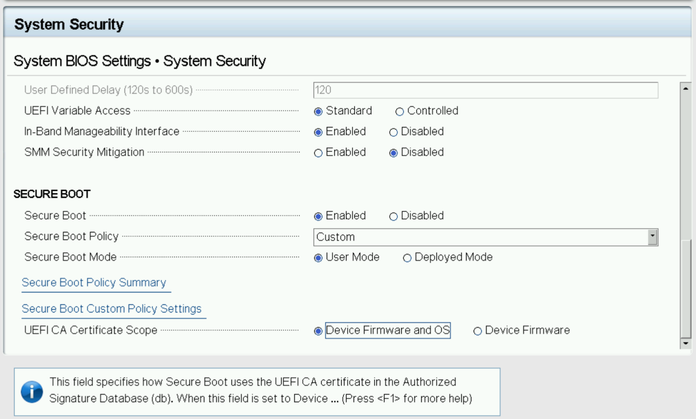
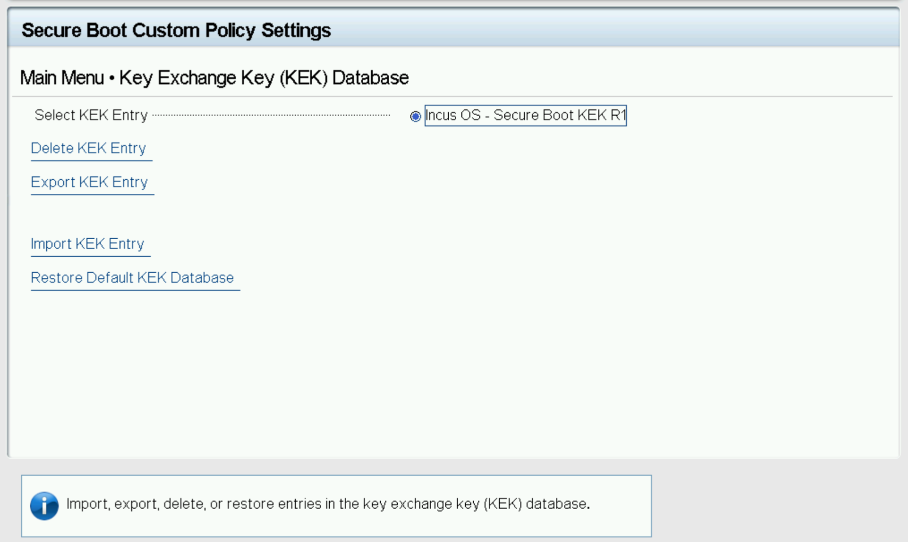
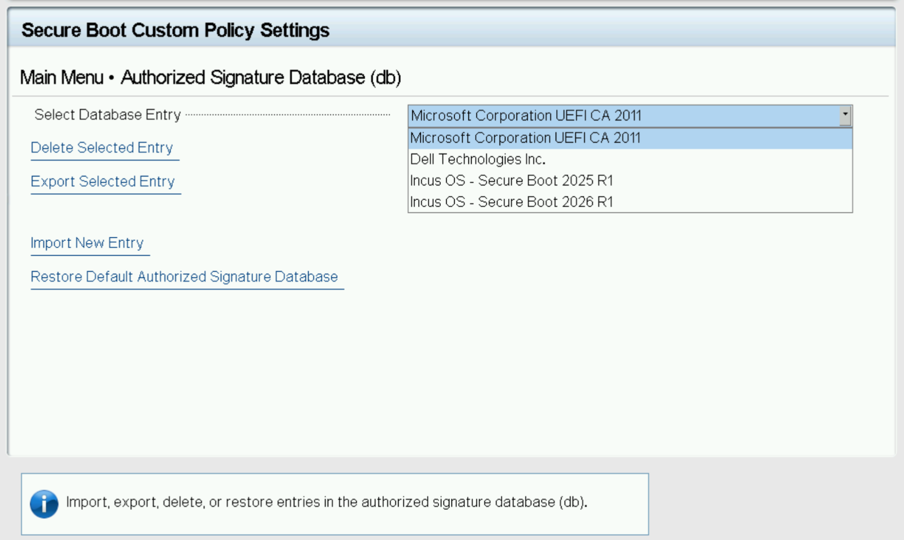
```

```{group-tab} HP
HPのサーバーはセキュアブートポリシーの細かい設定は提供していません。

しかし、すべてのキーをクリアーすること、カスタムのキーをロードすることはでき、これらのサーバーはブートするのに追加のセキュアブートキーに通常は依存していないようです。

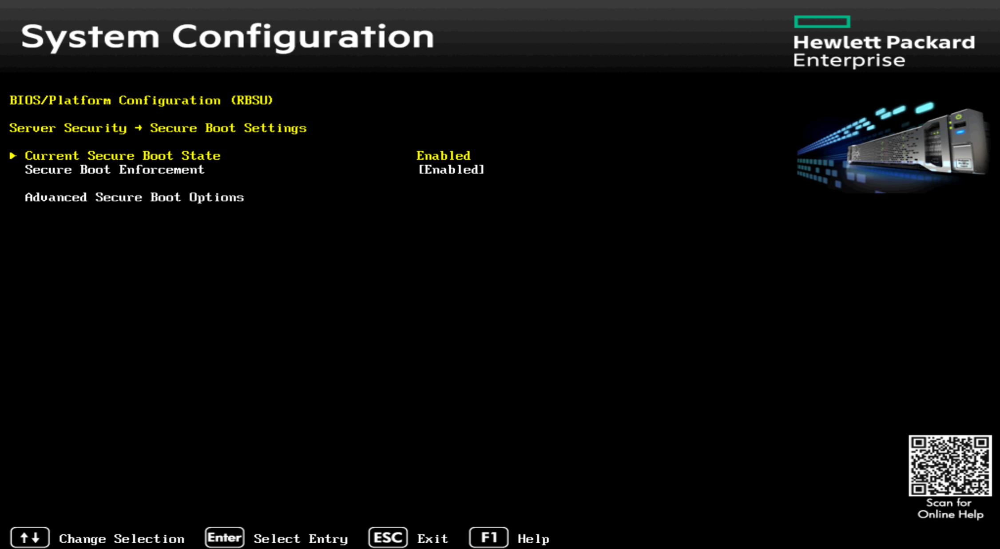
```

```{group-tab} Lenovo
LenovoのサーバーはファームウェアーにAMI Aptioを改変したバージョンを使用しています。

Lenovoが発行したDBのキーは無効なフィールドを含んでおり、一部のシステムで起動に問題があることが知られています。NVMEの起動を正しく行うにはMicrosoft UEFI CAキーがしばしば必要です。

さらに、いくつかのシステムで既存のTPMの状態のために問題が発生するのを観測しました。インストールの前にTPMをクリアーすることをお勧めします。

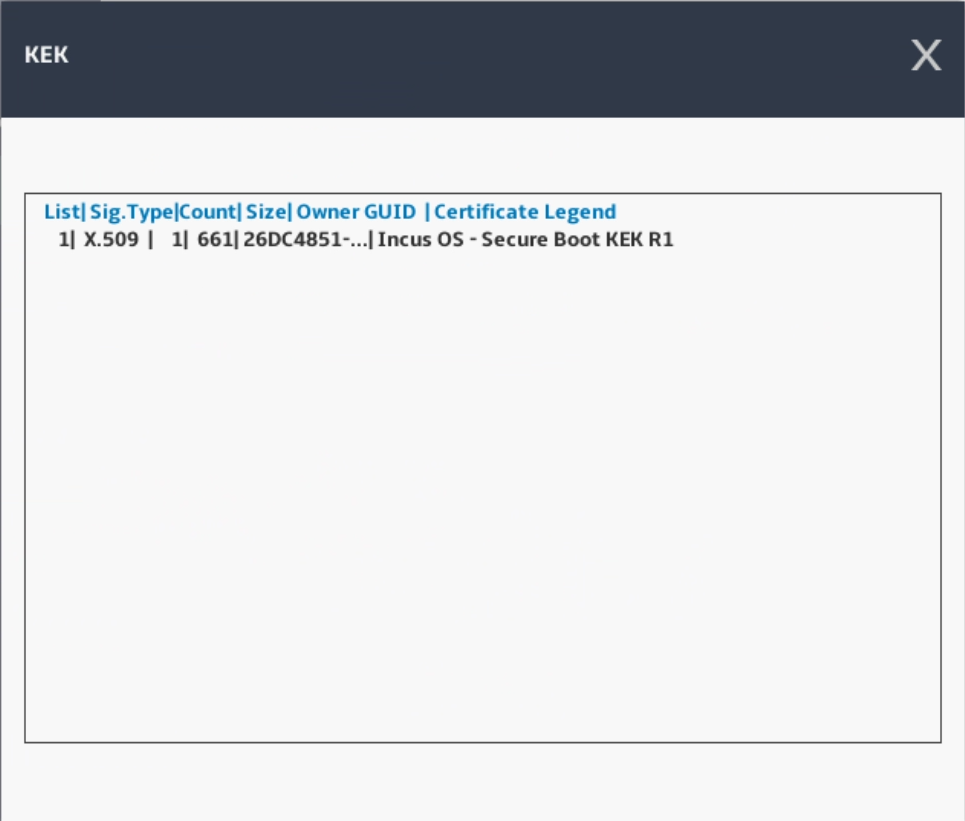
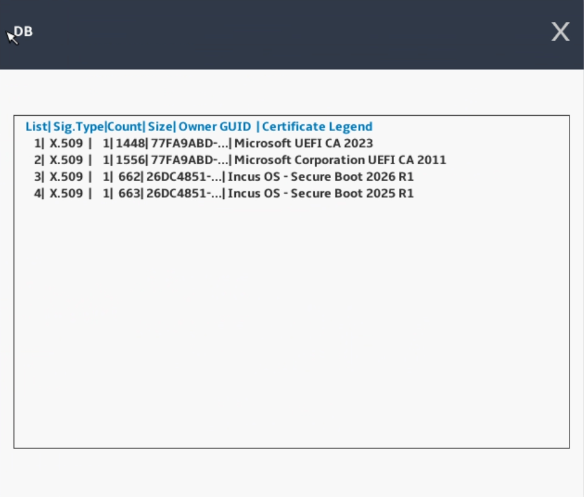
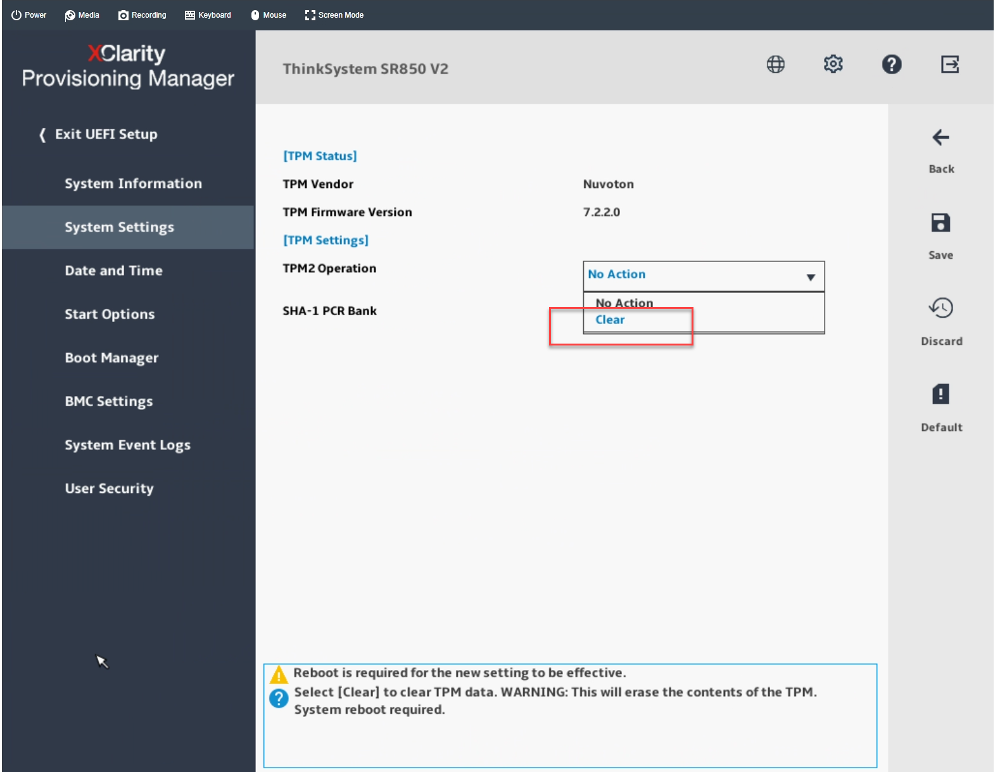
```

```{group-tab} SuperMicro
SuperMicroのサーバーはAMI Aptioベースのファームウェアーを標準的なレイアウトで使用しています。

これらのサーバーは通常のブート操作を処理するのに追加のセキュアブートキーをロードする必要はなく、結果として、すべてのDBキーを削除しても安全です。

ほとんどのサーバーではデフォルトでCSM（レガシーBIOS）が有効になっていますので、すべてのアドインカードがUEFIモードで稼働していることをまず確認し、それからCSMを無効化して起動を試みることが重要です。確実に動作するようになってから、セキュアブートの設定をするのが良いです。


```

````

## IncusOSのインストール

セキュアブートの設定によって、システムは直接インストーラーで起動する場合と、まず鍵のインポートを処理して再起動してインストーラーが起動する場合があります。

（セットアップモードを使って）鍵のインポートを処理する場合は、カウントダウンが表示され、最後にシステムが鍵をインポートして再起動します。

インストールの最後に、インストールメディアを取り外して、インストールされたIncusOSシステムを使って再起動します。

## IncusOSを使い始めます

再起動後、IncusOSは初回のブート時に設定を行います。完了したら、[システムへアクセス](../access.md)の手順に従ってください。


