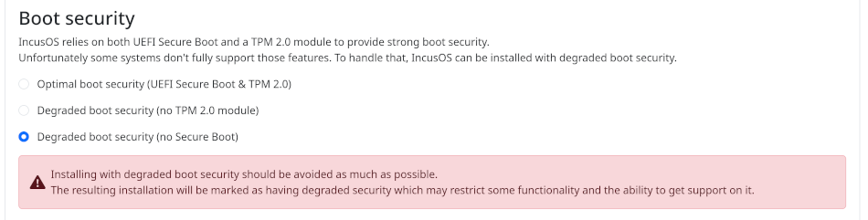
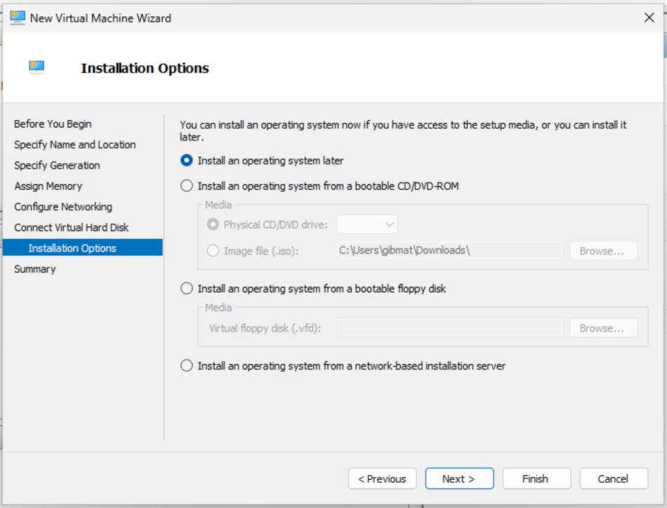
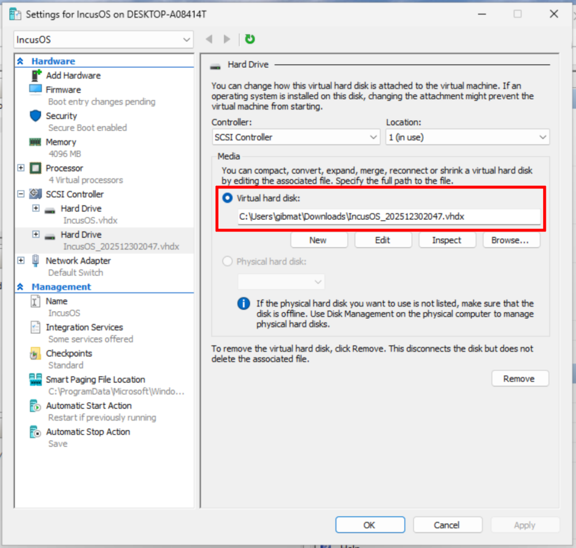
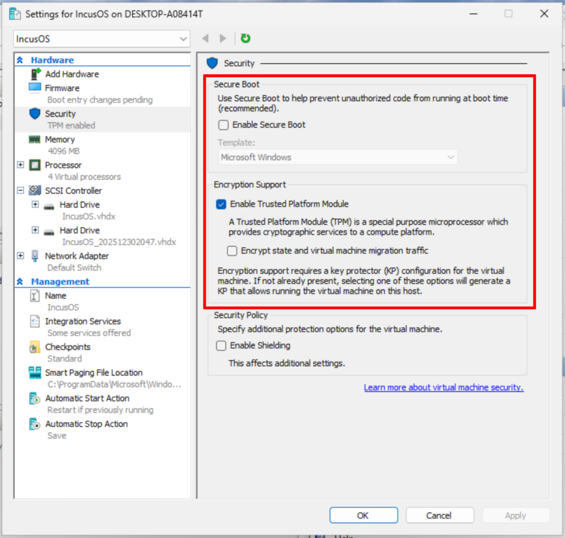
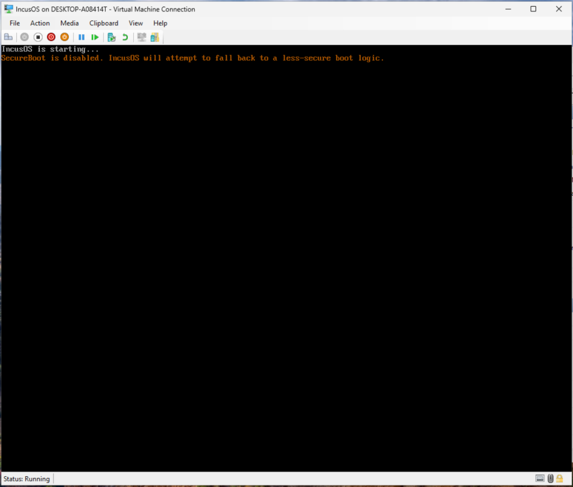
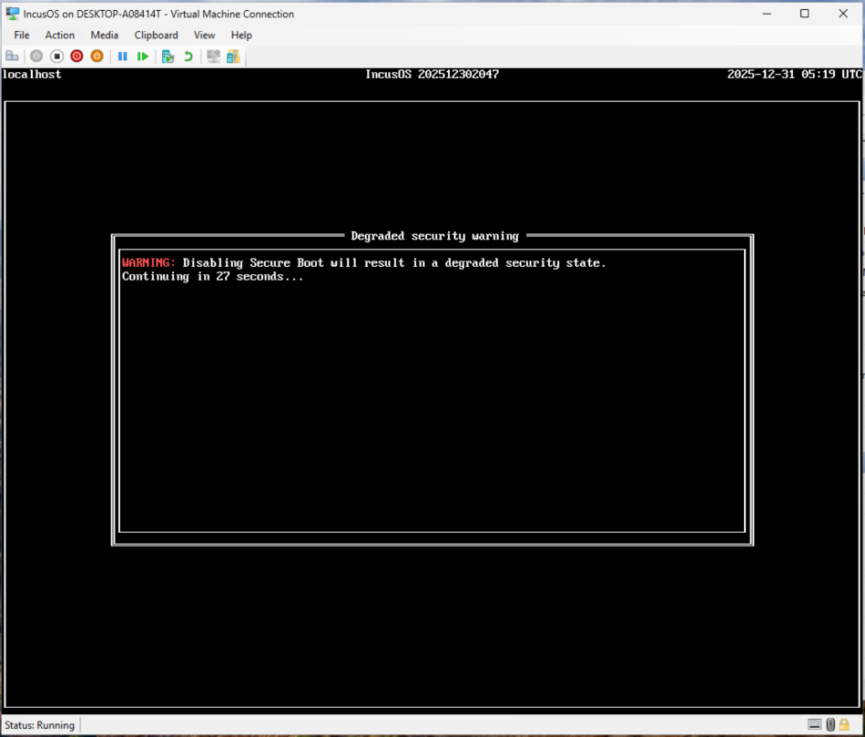
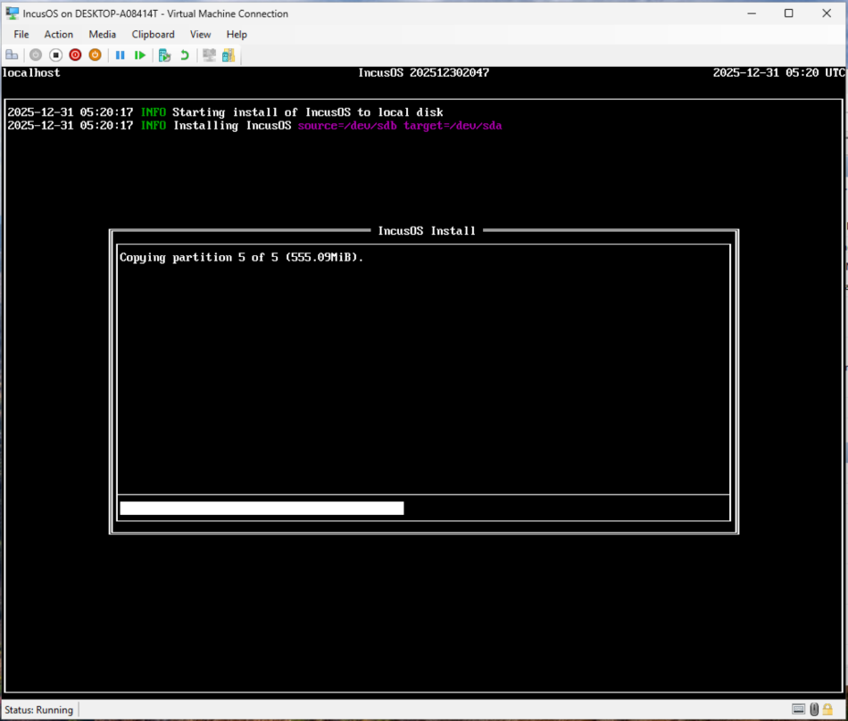
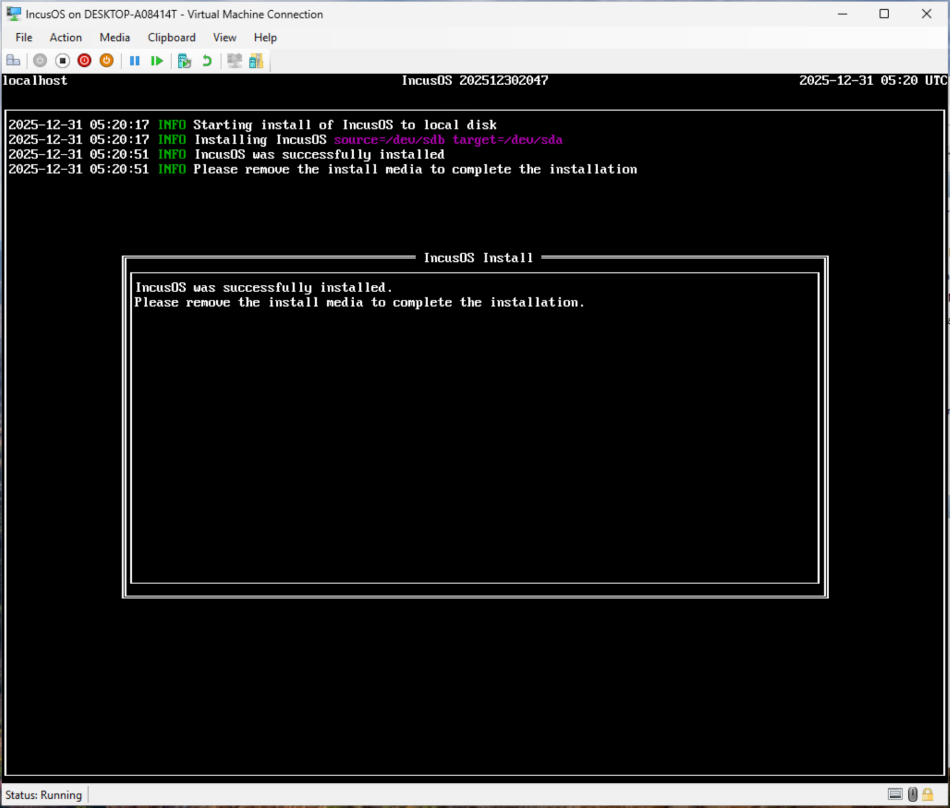
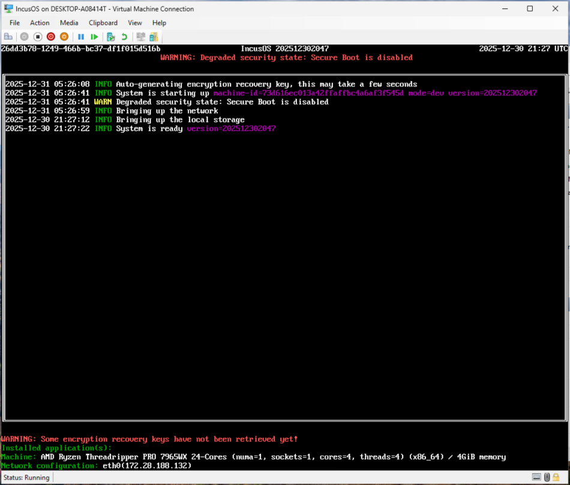

# Microsoft Hyper-V仮想マシン内にインストール

IncusOSはMicrosoft Hyper-V仮想マシン内にインストールできます。サポートされている仮想化プラットフォームの中で、正しく設定するのが断然に一番難しいのがHyper-Vです。

```{warning}
Microsoft Hyper-Vはカスタムのセキュアブートキーの登録をサポートしません。このため[セキュアブートを無効にする](../../reference/installing-without-secureboot.md)必要があり、結果としてセキュリティーが劣化した状態になります。これが意味することを完全に理解した場合にのみ以下に進んでください。
```

## インストールメディアを取得

[IncusOSイメージを取得](../download.md)する手順に従ってください。Hyper-VではUSB (IMG)インストールイメージを使う必要があります。CD-ROM (ISO)イメージは動作 _しません_。

インストールシードは`security.missing_secure_boot = true`を含む必要があります。ウェブベースのカスタマイザーUIを使う場合は、"Advanced settings"セクションでこの設定をできます。



## インストールメディアを変換

Hyper-Vはrawディスクイメージをサポートしないので、USBインスールメディアをダウンロード後、Hyper-Vが使える形式にインストールイメージを変換する必要があります：

```
qemu-img convert IncusOS_202512302047.img -O vhdx -o subformat=dynamic IncusOS_202512302047.vhdx
```

## 仮想マシンを作成

仮想マシンを作成し、インストールオプションを選択する際に、"Install an operating system later"を選びます。



仮想マシンが作成されたら、設定を開いて`.vhdx`イメージを2番目の仮想ハードディスクとして追加します。



### セキュアブートとTPMの設定

IncusOSはv2.0 TPMに依存しています。上で述べたようにHyper-V仮想マシン内でIncusOSを動かすにはセキュアブートを無効にする必要があります。仮想マシンを設定する際に、"Security"セクションで以下のように選択してください：

* "Enable Secure Boot"のチェックを外す

* "Enable Trusted Platform Module"にチェックをつける



### CPU、メモリ、ネットワーク、ローカルストレージ

仮想マシンのCPUとメモリをお好みで設定し、最低1つのネットワークインターフェースを追加してください。

メインシステムドライブを50GiB以上にする必要があることを忘れないでください。

## IncusOSのインストール

仮想マシンを起動します。IncusOSが起動する際、セキュアブートが無効になっていることに対する警告が表示されます。



インストールを開始する前に、この警告メッセージが30秒間表示されます。



その後ようやく、IncusOSのインストールが始まります。



インストールが完了したら、仮想マシンを停止し、2番目のハードディスクを取り外します。



## IncusOSを使い始めます

仮想マシンを起動すると、IncusOSは初回のブート時に設定を行います。完了したら[システムへアクセス](../access.md)の手順に従ってください。

セキュアブートが無効化されているため、システムのセキュリティが劣化している状態であることに対する警告がヘッダーに目立つように表示されます。


